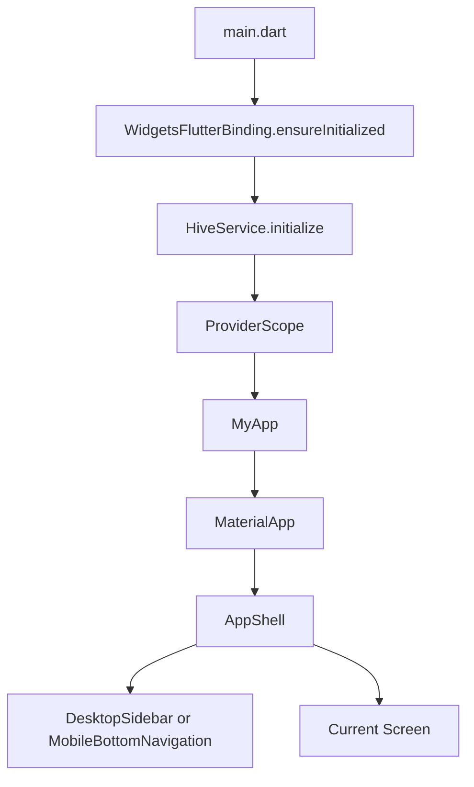
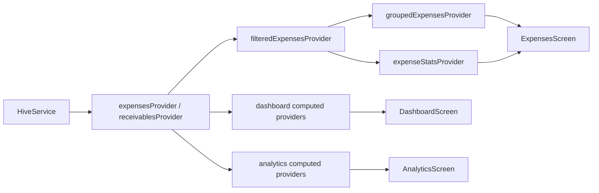
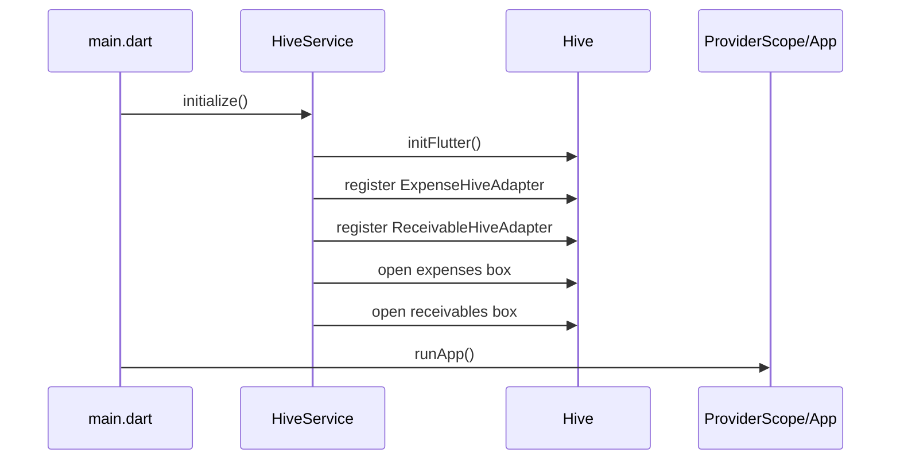
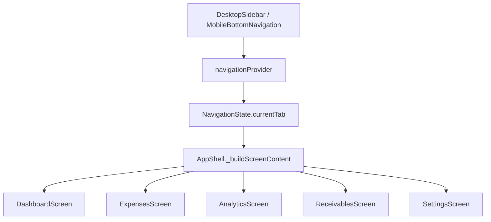
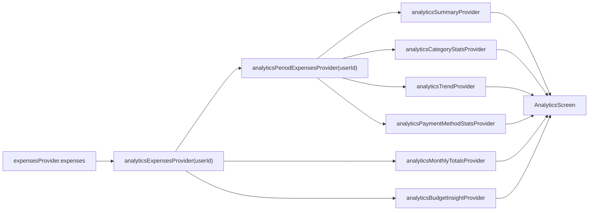
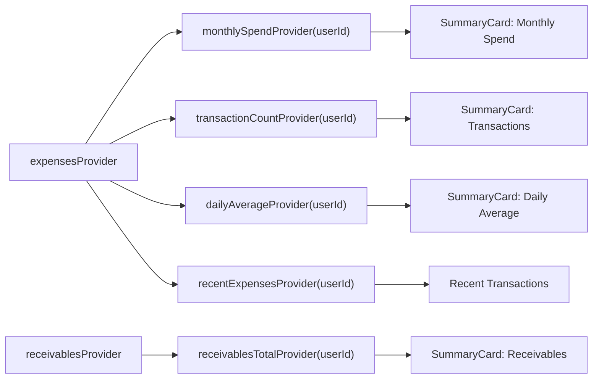

# Personal Expense Tracker Architecture

This document explains the current architecture of the Flutter personal finance app. It is written for future AI agents and human contributors so changes remain scoped, reactive, responsive, and consistent with the existing Hive + Riverpod implementation.

## Project Summary

Personal Expense Tracker is a Flutter fintech app for tracking expenses, receivables, dashboard summaries, and analytics. The app currently uses local-first persistence with Hive, Riverpod for state management, modular screen folders, reusable widgets, and a premium dark fintech design direction.

Core principles:

- UI belongs in screens and widgets.
- State and derived business logic belong in Riverpod providers.
- Persistence belongs in storage services.
- Domain data belongs in typed models.
- Shared styling belongs in the theme and constants.
- Screen-specific UI should remain modular and reusable.

## Complete Folder Structure

```text
lib/
  main.dart

  core/
    config/
      app_config.dart
    constants/
      app_constants.dart
      category_styles.dart
    errors/
      app_exception.dart
    extensions/
      extensions.dart
    navigation/
      navigation_models.dart
      navigation_provider.dart
    core.dart

  models/
    expense/
      expense_model.dart
      expense_hive_model.dart
      expense_hive_model.g.dart
    receivable/
      receivable_model.dart
      receivable_hive_model.dart
      receivable_hive_model.g.dart
    user/
      user_model.dart

  services/
    auth/
      auth_service.dart
    firebase/
      firebase_service.dart
    storage/
      hive_service.dart
      storage_service.dart

  providers/
    auth/
      auth_provider.dart
    expense/
      expense_provider.dart
    storage/
      storage_providers.dart
    theme/
      theme_provider.dart
    ui/
      ui_provider.dart

  navigation/
    app_shell.dart
    desktop_sidebar.dart
    mobile_bottom_navigation.dart
    navigation.dart

  screens/
    analytics/
      analytics.dart
      analytics_screen.dart
      models/
        analytics_models.dart
      providers/
        analytics_providers.dart
      widgets/
        analytics_charts.dart
        analytics_empty_state.dart
        analytics_section.dart
        analytics_summary_card.dart
        analytics_widgets.dart
        category_legend.dart
        chart_card.dart

    dashboard/
      dashboard.dart
      dashboard_screen.dart
      providers/
        dashboard_providers.dart
      widgets/
        budget_progress_card.dart
        dashboard_widgets.dart
        quick_action_button.dart
        section_header.dart
        summary_card.dart
        transaction_tile.dart

    expenses/
      expenses.dart
      expenses_screen.dart
      models/
        expense_view_models.dart
      providers/
        expenses_providers.dart
      utils/
        expense_helpers.dart
      widgets/
        add_expense_modal.dart
        amount_input.dart
        category_selector.dart
        edit_expense_modal.dart
        expense_date_picker.dart
        expense_details_sheet.dart
        expense_filters_sheet.dart
        expense_list_item.dart
        expense_notes_field.dart
        expense_section_header.dart
        expense_stats_header.dart
        expenses_widgets.dart
        payment_method_selector.dart
        save_expense_button.dart

    receivables/
      receivables.dart
      receivables_screen.dart
      providers/
        receivables_providers.dart
      widgets/
        receivables_widgets.dart

    settings/
      settings.dart
      settings_screen.dart
      providers/
        settings_providers.dart
      widgets/
        settings_widgets.dart

    screens.dart

  theme/
    app_theme.dart

  utils/
    formatters/
      formatters.dart
    helpers/
      app_helpers.dart
    validators/
      validators.dart

  widgets/
    common/
      common_widgets.dart
    inputs/
      input_widgets.dart
    responsive/
      responsive_widgets.dart
```

Generated Flutter platform folders live at the project root: `android/`, `ios/`, `web/`, `windows/`, `macos/`, and `linux/`. Generated build output belongs under `build/` and should not be treated as source architecture.

## High-Level Runtime Flow



`main.dart` is responsible for app startup only. It initializes Hive before the widget tree starts, then wraps the app in `ProviderScope` so all Riverpod providers can be consumed by screens and widgets.

## Screen Architecture

Each feature screen follows a modular pattern:

- `feature_screen.dart`: screen composition, Scaffold, layout, and user interaction wiring.
- `providers/feature_providers.dart`: screen-specific state, filters, derived data, and reactive computations.
- `widgets/`: focused UI components used by the feature screen.
- `models/`: view models that support feature-specific UI state.
- `utils/`: feature-specific helper logic when needed.
- `feature.dart`: barrel file for cleaner imports.

Screens should compose widgets and watch providers. They should not contain persistence code or complex business calculations.

### Current Screen Responsibilities

| Screen | Responsibility | Current Maturity |
| --- | --- | --- |
| Dashboard | Financial overview, monthly spend, receivables total, recent transactions, quick actions | Mostly reactive, reads stored expense and receivable state |
| Expenses | Expense list, add/edit/delete, filters, search, sorting, grouped sections, stats | Most complete feature |
| Analytics | Category breakdown, monthly totals, trends, payment mix, budget insights | Derived from expense provider |
| Receivables | Money owed to user | Model/storage exist; UI is still placeholder-heavy |
| Settings | Preferences and account/settings entry points | Provider scaffold exists; UI persistence is incomplete |

## Provider Architecture

Riverpod is the reactive backbone of the app. Providers fall into three broad groups:

- Source-of-truth state providers: own mutable state loaded from Hive.
- UI state providers: own filters, selected tabs, theme mode, and temporary UI choices.
- Computed providers: derive totals, groups, stats, chart data, and summaries from source state.

### Important Provider Locations

| Provider Area | File | Purpose |
| --- | --- | --- |
| Hive-backed expenses and receivables | `lib/providers/storage/storage_providers.dart` | Source-of-truth app data loaded from Hive |
| Expense filters and derived list stats | `lib/screens/expenses/providers/expenses_providers.dart` | Search, filters, grouped expenses, totals |
| Dashboard summary providers | `lib/screens/dashboard/providers/dashboard_providers.dart` | Monthly spend, transaction count, daily average, receivables total |
| Analytics providers | `lib/screens/analytics/providers/analytics_providers.dart` | Period filtering, category stats, chart data, budget insight |
| Navigation provider | `lib/core/navigation/navigation_provider.dart` | Current tab and sidebar state |
| Theme provider | `lib/providers/theme/theme_provider.dart` | Theme mode state |
| Settings provider | `lib/screens/settings/providers/settings_providers.dart` | Settings state scaffold |
| Auth provider | `lib/providers/auth/auth_provider.dart` | Authentication scaffold |

### Riverpod Reactivity Model



When expenses or receivables change, the source provider state changes. Any provider that watches that state recomputes automatically, and any widget watching those derived providers rebuilds.

Future changes should prefer this pattern over manual refresh chains.

## Hive Persistence Flow

Hive is the local source of truth for expense and receivable records.

### Startup



### Expense Write

```mermaid
sequenceDiagram
  participant UI as Add/Edit/Delete UI
  participant Provider as ExpensesNotifier
  participant Service as HiveService
  participant Box as Hive Box
  participant Derived as Computed Providers

  UI->>Provider: addExpense/updateExpense/deleteExpense
  Provider->>Service: persist change
  Service->>Box: put/delete
  Provider->>Provider: update Riverpod state
  Provider->>Derived: notify watchers
  Derived->>UI: rebuild dependent widgets
```

### Persistence Ownership

Persistence logic belongs in:

- `lib/services/storage/hive_service.dart` for direct Hive box access and model conversion.
- `lib/providers/storage/storage_providers.dart` for app-facing Riverpod notifiers that call `HiveService`.

Persistence logic should not be placed inside screens, modals, or reusable widgets.

### Hive Compatibility Rules

- `ExpenseHive` and `ReceivableHive` adapters are persistence schema contracts.
- Do not casually change Hive type IDs.
- Do not remove fields without migration planning.
- Add new fields carefully with defaults or compatibility handling.
- Keep domain models and Hive models intentionally mapped through `HiveService`.

## Navigation Flow

Navigation is currently tab-state based rather than route-stack based.



`AppShell` chooses the navigation chrome based on width:

- Desktop: `DesktopSidebar` appears when width is at least `900`.
- Mobile/tablet: `MobileBottomNavigation` appears below the content.

Screen switching is controlled by `navigationProvider`, `NavigationTab`, and `NavigationTabExtension`.

## Analytics System

Analytics is derived from expenses. It should remain a computed-provider system, not a separate manually synchronized store.

Key flow:



Analytics providers currently compute:

- Period-filtered expense sets.
- Total spend and average daily spend.
- Top category and category percentage distribution.
- Six-month monthly totals.
- Weekly/monthly/yearly trend points.
- Payment method totals inferred from expense descriptions.
- Budget baseline and projected current-month spend.

Analytics UI belongs in `screens/analytics/widgets/`. Chart components should accept prepared view models or simple chart-ready data, not perform persistence or broad business logic.

## Dashboard Reactive Flow

The dashboard reads reactive computed providers rather than owning all summary data itself.



`DashboardNotifier` still exists and can fetch dashboard data, but the preferred direction is reactive computed providers. Future dashboard work should reduce manual refresh dependence and avoid duplicating derived totals.

## Expense Management Flow

Expenses are the most complete feature and should be preserved carefully.

### Add Expense

1. `ExpensesScreen` or `DashboardScreen` opens `AddExpenseModal`.
2. Modal collects amount, category, date, payment method/notes, and other form data.
3. A typed `Expense` is created.
4. `expensesProvider.notifier.addExpense(expense)` writes to Hive through `HiveService`.
5. Provider state updates.
6. Expense list, dashboard summaries, and analytics recompute automatically.

### Edit Expense

1. Existing expense is passed to `EditExpenseModal`.
2. User changes fields.
3. `expensesProvider.notifier.updateExpense(id, expense)` persists the updated object.
4. Computed providers rebuild.

### Delete Expense

1. `ExpensesScreen` confirms delete.
2. `expensesProvider.notifier.deleteExpense(id)` deletes from Hive and state.
3. UI shows undo.
4. Undo re-adds the previous `Expense`.

### Expense Derived State

`screens/expenses/providers/expenses_providers.dart` owns:

- Search query.
- Selected categories.
- Date range.
- Amount range.
- Sort mode.
- Filtered expense list.
- Grouped expenses by date.
- Expense stats.
- Category totals.

Do not move this filtering and grouping logic into `ExpensesScreen` or row widgets.

## Receivables System

Receivables have domain and Hive models, storage methods, and a source provider:

- Domain model: `models/receivable/receivable_model.dart`
- Hive model: `models/receivable/receivable_hive_model.dart`
- Hive methods: `HiveService.getAllReceivables`, `addReceivable`, `updateReceivable`, `deleteReceivable`
- Riverpod source state: `receivablesProvider`

The current `ReceivablesScreen` is still mostly placeholder UI. Future work should mirror the expense feature architecture:

- Add typed receivable list items.
- Add modal or sheet for creating receivables.
- Add edit/delete/mark-paid flows.
- Use `receivablesProvider` as the Hive-backed source of truth.
- Use computed providers for unpaid totals, paid/unpaid filters, due-soon groups, and summary cards.

Avoid using `dynamic` in receivable UI state as the feature matures.

## Reusable Widget Philosophy

Reusable widgets should be small, focused, and presentation-oriented.

Good widget responsibilities:

- Render a summary card.
- Render a transaction tile.
- Render an input field.
- Render a chart shell.
- Render an empty state.
- Render a selector or filter control.

Poor widget responsibilities:

- Reading and writing Hive directly.
- Computing feature-wide business summaries.
- Owning duplicated filter state.
- Hardcoding colors outside the theme system.
- Mixing unrelated feature concerns.

Feature widgets belong under `screens/<feature>/widgets/` when they are feature-specific. Truly shared widgets belong under `widgets/common/`, `widgets/inputs/`, or `widgets/responsive/`.

## Responsive Design Strategy

The app supports mobile, tablet, desktop, and wide desktop layouts. Responsiveness is achieved with:

- `MediaQuery` width checks in major shells and screens.
- `LayoutBuilder` for local layout decisions.
- Grid column changes based on available width.
- Desktop sidebar for large screens.
- Bottom navigation for smaller screens.
- Scrollable page bodies to avoid overflow.
- Wrap-based action layouts where button counts may vary.

Common breakpoints in use:

| Width | Treatment |
| --- | --- |
| `< 600` | Mobile |
| `600 - 899` | Tablet / compact navigation |
| `>= 900` | Desktop navigation shell |
| `>= 1000 / 1100 / 1200` | Wider analytics and dashboard layouts |

Future UI changes must be checked at narrow mobile widths and desktop widths. Avoid fixed widths unless they are wrapped in responsive constraints.

## Mobile vs Desktop Handling

### Mobile

- Bottom navigation is used.
- Forms must be keyboard-safe.
- Lists should scroll naturally.
- Modals and sheets should account for `viewInsets`.
- Controls should have comfortable tap targets.
- Avoid dense multi-column layouts.

### Desktop

- Sidebar navigation is used.
- Dashboard and analytics can use multi-column layouts.
- Summary cards can use wider grid arrangements.
- Actions can be grouped in `Wrap` or row layouts.
- Content should remain constrained enough to scan comfortably.

Feature behavior should remain the same across device classes. Only layout and density should change.

## Theme System

Theme definitions live in `lib/theme/app_theme.dart`. Runtime theme state lives in `lib/providers/theme/theme_provider.dart`.

Rules:

- Use `Theme.of(context)` and `ColorScheme` values in widgets.
- Avoid hardcoded colors in feature UI.
- Category-specific colors and icons belong in `core/constants/category_styles.dart`.
- The current product direction is dark fintech UI. Light theme support may exist structurally, but future design polish should prioritize dark mode.
- Keep typography, spacing, surfaces, borders, and shadows consistent with existing cards and sections.

Typical access pattern:

```dart
final theme = Theme.of(context);
final colorScheme = theme.colorScheme;
```

## Formatter Utilities

Formatting utilities live in `lib/utils/formatters/formatters.dart`.

Use formatters for:

- Currency display.
- Dates.
- Relative time.
- Percentages or compact numbers if added later.

Formatting should not be duplicated across screens. If multiple screens need the same display rule, add or reuse a formatter.

Related utility areas:

- `utils/helpers/app_helpers.dart`: app-level helper functions.
- `utils/validators/validators.dart`: input validation rules.
- `screens/expenses/utils/expense_helpers.dart`: expense-specific helper logic.

## Where Logic Belongs

| Logic Type | Correct Location |
| --- | --- |
| Hive box access | `services/storage/hive_service.dart` |
| App source-of-truth data state | `providers/storage/storage_providers.dart` |
| Feature filters and derived feature data | `screens/<feature>/providers/` |
| Navigation state | `core/navigation/` |
| Theme state | `providers/theme/` |
| UI composition | `screens/<feature>/<feature>_screen.dart` |
| Feature-specific presentation widgets | `screens/<feature>/widgets/` |
| Shared widgets | `widgets/` |
| Domain data shape | `models/` |
| Formatting | `utils/formatters/` |
| Validation | `utils/validators/` |
| Constants and category styling | `core/constants/` |

## Current Known Gaps

These are architecture-relevant gaps future work may address:

- Hardcoded `userId` is used in multiple screens and providers.
- Auth and Firebase services are scaffolds, not active production integrations.
- Receivables UI is incomplete compared with expenses.
- Settings persistence is not implemented.
- Some older providers still use `dynamic` and TODO placeholders.
- The default widget test does not match the app.
- Manual refresh still exists in some places where computed providers can do the work.

Address these incrementally. Do not rewrite stable expense, dashboard, or analytics systems unless the user explicitly requests that scope.

## Future Scalability Plan

Recommended evolution path:

1. Stabilize the local-first architecture.
   - Keep Hive as the source of truth.
   - Remove duplicate stale providers.
   - Replace `dynamic` state with typed models.

2. Complete receivables.
   - Mirror expense CRUD patterns.
   - Add computed providers for unpaid totals and due status.
   - Add polished responsive UI.

3. Replace hardcoded user ID.
   - Introduce a current-user provider.
   - Ensure all expense and receivable providers remain user-scoped.

4. Persist settings.
   - Use a storage service or Hive-backed settings model.
   - Keep settings reactive through Riverpod.

5. Improve tests.
   - Add provider tests for expense filtering, analytics, and dashboard summaries.
   - Add widget tests for key empty states and CRUD flows.

6. Prepare optional sync.
   - If Firebase or another backend is introduced, treat it as a sync layer.
   - Do not bypass Hive without a deliberate migration plan.
   - Keep UI dependent on providers, not backend SDKs.

7. Expand analytics.
   - Add budget entities.
   - Add recurring expense detection.
   - Add export/report flows.
   - Keep calculations in providers or dedicated domain services.

## Agent Development Checklist

Before changing code:

- Read the relevant screen, provider, model, and service files.
- Identify the current source of truth.
- Prefer computed providers over duplicated derived state.
- Keep UI widgets focused on rendering and user interaction.
- Preserve Hive schema compatibility.
- Check mobile and desktop layouts for overflow.
- Use theme colors and existing design primitives.
- Run `flutter analyze` when the local Flutter toolchain allows it.
- Report blocked validation clearly.

The safest contribution style is small, typed, reactive, and consistent with the existing feature folders.
